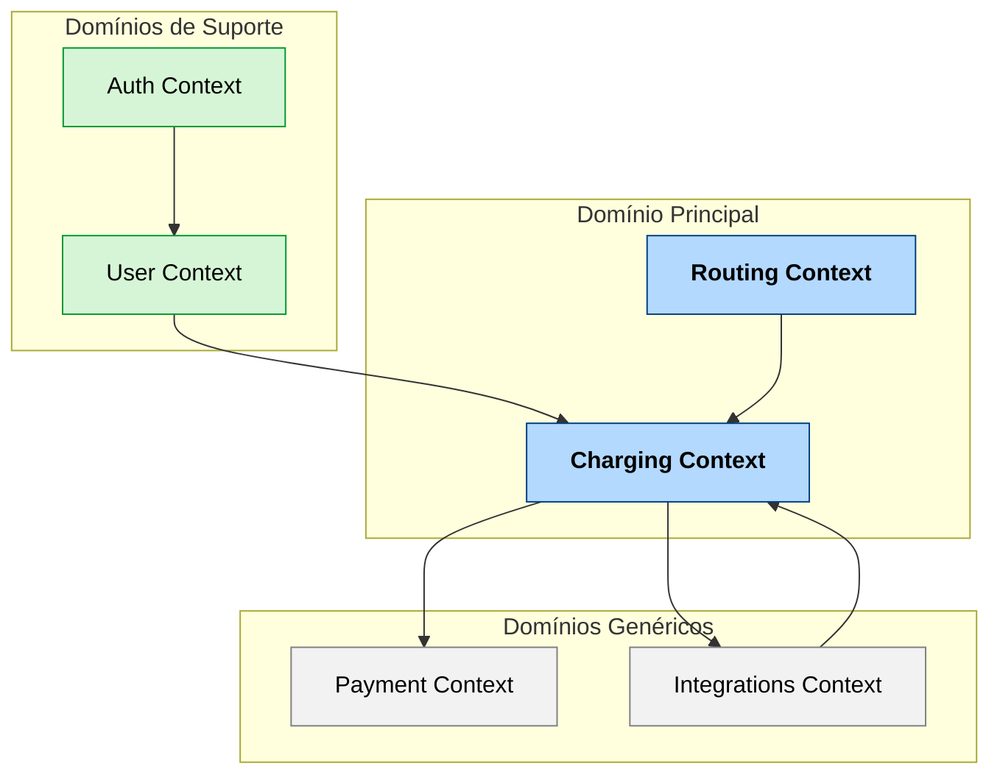

# **Context Map — DDD Leve (POC Soluções EV-Costa)**

## **1. Objetivo**
Este documento define o **mapa de contextos (Context Map)** da arquitetura de domínio da POC *Soluções EV-Costa*.  
O objetivo é representar como os domínios interagem, quais fronteiras existem entre os microsserviços e os tipos de dependência entre eles.

A modelagem segue o **DDD leve**, mantendo a simplicidade necessária para uma POC, mas com as fronteiras claras para futura evolução ao MVP.

---

## **2. Contextos Principais (Bounded Contexts)**

| Contexto | Domínio | Descrição |
|-----------|----------|-----------|
| **Auth Context** | Identidade | Responsável pela autenticação, autorização e gestão de tokens JWT (OIDC). |
| **User Context** | Usuário | Gerencia cadastro, preferências e dados tokenizados dos usuários. |
| **Routing Context** | Navegação EV | Calcula rotas otimizadas considerando autonomia (SoC) e pontos de recarga disponíveis. |
| **Charging Context** | Recarga | Controla o ciclo de vida das sessões de recarga e publica eventos Kafka. |
| **Payment Context** | Pagamento | Simula tokenização e processamento de pagamentos. |
| **Integrations Context** | Integração | Isola comunicações externas (Shell Recharge, DSA-X, Premmia, etc.) por meio de uma camada anticorrupção. |

---

## **3. Relações Entre Contextos**

### **3.1 Contextos Core**
- **Charging Context** e **Routing Context** formam o **núcleo da solução (Core Domain)**.  
- São os contextos com maior valor de negócio e complexidade técnica.  
- Todos os demais contextos servem de suporte ou integração a esses.

### **3.2 Contextos Suporte**
- **Auth Context** e **User Context** são contextos *Supporting*, necessários ao funcionamento do sistema, mas não centrais ao domínio EV.  
- São comuns a múltiplos sistemas e podem ser externalizados no futuro.

### **3.3 Contextos Genéricos**
- **Integrations Context** é *Generic* — encapsula dependências externas, implementando *Anti-Corruption Layer (ACL)*.  
- **Payment Context** também pode ser considerado *Generic* ou *Supporting*, pois usa abstrações de gateway externas.

---

## **4. Tipos de Relacionamento**

| Tipo | Descrição | Exemplo |
|------|------------|---------|
| **Upstream / Downstream** | Indica dependência hierárquica de dados ou eventos. | Charging depende de Auth e Routing. |
| **Customer / Supplier** | Um contexto consome serviços de outro. | User consome Auth. |
| **Conformist** | Um contexto aceita o modelo de dados do outro. | Payment adota formato de evento de Charging. |
| **Anti-Corruption Layer (ACL)** | Contexto intermediário que adapta APIs externas. | Integrations Context. |
| **Shared Kernel** | Domínio pequeno compartilhado entre contextos. | Modelos de segurança (claims, roles). |

---

## **5. Mapa de Contextos (Diagrama Mermaid)**

## 6. Notas de Design

* **Charging** e **Routing** são os únicos contextos que compartilham entidades derivadas (veículo, sessão, rota).
* O **Integrations Context** nunca expõe entidades externas diretamente, apenas eventos normalizados.
* O **Auth Context** define o modelo de claims compartilhado com **User** e **Charging** via **Shared Kernel**.
* **Payment** usa **Chain of Responsibility** para aplicar regras antifraude e validações tokenizadas.

## 7. Diretrizes de Evolução

* O **Charging Context** será o primeiro candidato à implementação no **MVP**.
* O **Routing Context** deve evoluir para consumir APIs reais (**GraphHopper/OSRM**).
* **Integrations Context** poderá incorporar provedores adicionais sem alterar os outros contextos.
* A comunicação entre contextos será sempre rastreável via **traceId global (OpenTelemetry)**.

**Responsável:**
Arquiteto de Software — *Soluções EV-Costa*

**Revisores:**
Engenharia Backend / Domain Experts / Segurança da Informação

---
